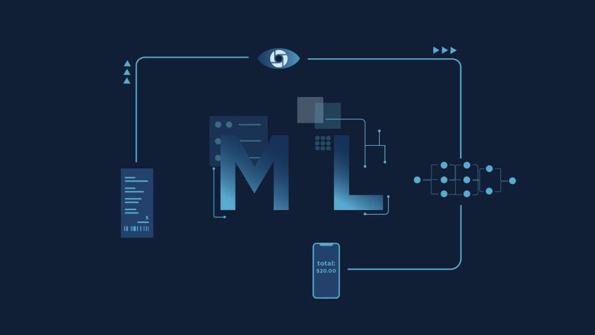
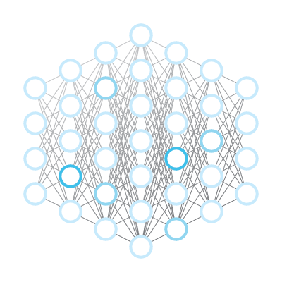

 

 

## 🧠 About Me

I build systems that **learn** and the infrastructure that lets them ship.

My work spans the full arc of a model's life: framing the problem, training the network, and wrapping it in an API that survives real traffic. Lately that has meant RAG pipelines for compliance auditing, diffusion and GAN experiments, and reinforcement-learning agents that teach themselves to play.

- 🎓 **Oxford LMH Intensive AI Programme** — University of Oxford
- 🏛️ **Qassim University** — Computer Science
- 🛠️ **Building with:** PyTorch · TensorFlow · Langchain · FastAPI · ASP.NET Core
- 📫 **Reach me at:** [yousef.alogiley@gmail.com](mailto:yousef.alogiley@gmail.com)

 

## ⚙️ Tech Stack

**Languages**

**AI / Machine Learning**

**Backend & Data**

**Tools**

## 📊 GitHub Stats

  

  

---

> *"Do not wait to strike till the iron is hot; but make it hot by striking."*
>
> **— William Butler Yeats**

 

